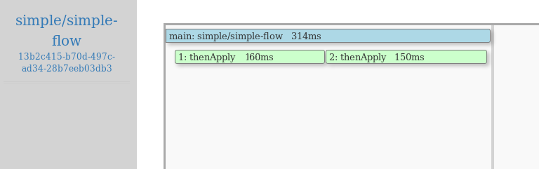
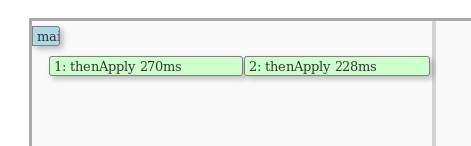

# Flow 101

#### `Under Construction: Check back soon`
```
Due to ongoing changes to Fn core, parts of this tutorial 
may not function as described. Check back for updates.
```

This tutorial is based on [Matthew Gilliard's "Flow 101" blog post](https://mjg123.github.io/2017/10/10/FnProject-Flow-101.html). 

:point_up: Please be aware that the Fn Flow API has evolved since Matthew wrote his "Flow 101" post.

```
Note that the API has changed since Matthew wrote that blog
post, the details of this tutorial have changed, but the philosophy
remains the same.
```

[Fn Project](http://fnproject.io/) was released in October 2017. [Chad Arimura](https://twitter.com/chadarimura/) explained the motivation and structure of the project in a good amount of detail in his post ["8 Reasons why we built the Fn Project"](https://medium.com/fnproject/8-reasons-why-we-built-the-fn-project-bcfe45c5ae63), with one of the major components being **Fn Flow**. Flow allows developers to build high-level workflows of functions with some notable features:

  - Flexible model of function composition. Sequencing, fan out/in, retries, error-handling and more.
  - Code-driven. Flow does not rely on massive yaml or json descriptors or visual graph-designers. Workflows are defined *in code*, expressed as a function, naturally.
  - Inspectable. Flow shows you the current state of your workflow, allows you to drill into each stage to see logs, stack traces and more.
  - Language agnostic. The initial Flow implementation which this post will use is in Java but support for other langauges has already started including Python, [Go](https://github.com/fnproject/flow-lib-go) and JS.

## What is a Flow?

A Flow is a way of linking together functions, and incidentally provides a way to define those functions inline if you need to. It's a FaaS-friendly way of saying stuff like

> Start with **this**, then do **that**, then take the result and do **these things** in parallel then when they've all finished do **this one last thing**, and if there's any errors then do **this** to recover

Where all the *this* and *that* are FaaS functions.


A simple Flow function looks like this:

```java

    public String handleRequest(int x) {

        Flow flow = Flows.currentFlow();
        String funcToInvoke = "..."; // functionId of the function to invoke

        return flow.completedValue(x)
                   .thenApply(i -> i+1)
                   .thenCompose( s -> Flow.invokeFunction(funcToInvoke, ... )
                   .get();
    }

```
:point_up: For illustration purpose, the above code is a simplification of the Fn Flow API and hence it won't compile as-is.

If you've used a promises-style API before then this will be familiar. The closest analogue in core Java is the [CompletionStage API](https://docs.oracle.com/apps/search/search.jsp?category=java&product=e92405-01&q=completionstage).

Anyway it's easy to tell the stages of what's going to happen:

  - Start with a value provided by the user
  - then apply some transformation `i -> i+1`
  - then pass that to an external function
  - finally wait for the return and return it.

Internally the `Flow` class submits each stage in this workflow to the Flow Server. You'll meet it soon. The Flow Server will then orchestrate each stage as an individual call to Fn. Flow Server is responsible for working out which stages are ready to be called, calling them, handling the results and triggering any following stages until you reach the point where there's no more work to do.

This example could easily be written without Flow but it's good to start simple.

## Before you begin

Currently FnProject is available to download, to experiment with, and to run on your private cloud. A managed service by Oracle is in the works. To play with Flow at the moment you will need to run everything locally, but it's not hard. We need **`fn`**, the **Fn Server**, the **Flow Server** and not necessary but nice-to-have is the Flow Server **UI**. These run on ports 8080, 8081 and 3002 respectively so you might need to configure firewalls to allow access.

> As you make your way through this tutorial, look out for this icon . Whenever you see it, it's time for you to perform an action.

### Setting up

Install the **`fn`** CLI tool:


```sh
curl -LSs https://raw.githubusercontent.com/fnproject/cli/master/install | sh
```

Then start the Fn server:

You can either do this in the background...

>```sh
>fn start -d
>```

...or the foreground.

```sh
fn start
```

If you started the Fn server in the foreground, the output looks something like the following. The version number below is old. You should see the latest version number in your case.

```
...
time="2017-10-11T13:12:44Z" level=info msg="Serving Functions API on address `:8080`"
        ______
       / ____/___
      / /_  / __ \
     / __/ / / / /
    /_/   /_/ /_/
        v0.3.629
```

If your Fn server is running in the foreground, you will need a new
terminal window.

The **Flow Server** needs to know how to call the Fn server, so ask Docker which IP address to use.


<!-- The HTML is required to escape Jekyll Liquid template expressions.
Otherwise, double brackets and their contents are stripped from output.
 -->
<blockquote>
<pre><code>
FNSERVER_IP=$(docker inspect --type container -f '&#123;&#123;.NetworkSettings.IPAddress&#125;&#125;' fnserver)
</code></pre>
</blockquote>

Start the **Flow Server**:


>```sh
>docker run --rm -d \
>      -p 8081:8081 \
>      -e API_URL="http://$FNSERVER_IP:8080/invoke" \
>      -e no_proxy=$FNSERVER_IP \
>      --name flowserver \
>      fnproject/flow:latest
>```

Then start the Flow **UI**:


<!-- The HTML is required to escape Jekyll Liquid template expressions.
Otherwise, double brackets and their contents are stripped from output.
 -->
<blockquote>
<pre><code>
FLOWSERVER_IP=$(docker inspect --type container -f '&#123;&#123;.NetworkSettings.IPAddress&#125;&#125;' flowserver)
</code></pre>
</blockquote>


```sh
docker run --rm -d \
       -p 3002:3000 \
       --name flowui \
       -e API_URL=http://$FNSERVER_IP:8080 \
       -e COMPLETER_BASE_URL=http://$FLOWSERVER_IP:8081 \
       fnproject/flow:ui
```


Now, everything's set so lets crack on!


## A simple Flow function

Create a new function:


>```sh
>fn init --runtime java --trigger http simple-flow
>```

Change directory:


```sh
cd simple-flow
```

Flow has a comprehensive test framework, but lets concentrate on playing with the code for the time being:


```sh
rm -rf src/test   ## yolo
```

Make peace with yourself after that, then let's get the code in shape.


 Change `src/main/java/com/example/fn/HelloFunction.java` to look like this:

```java
package com.example.fn;
import com.fnproject.fn.api.flow.Flow;
import com.fnproject.fn.api.flow.Flows;
import com.fnproject.fn.runtime.flow.FlowFeature;
import com.fnproject.fn.api.FnFeature;

import java.io.Serializable;

@FnFeature(FlowFeature.class)
public class HelloFunction implements Serializable {

  public String handleRequest(int x) {
    Flow fl = Flows.currentFlow();

    return fl.completedValue(x)
      .thenApply( i -> i * 2)
      .thenApply( i -> "your number is: " + i + "\n")
      .get();
  }
}
```

Before we can build this we need to add the Flow dependencies to the
pom.xml file.


Edit pom.xml so that the dependencies section looks like this:
```
    <dependencies>
        <dependency>
            <groupId>com.fnproject.fn</groupId>
            <artifactId>api</artifactId>
            <version>${fdk.version}</version>
        </dependency>

        <dependency>
          <groupId>com.fnproject.fn</groupId>
          <artifactId>flow-runtime</artifactId>
          <version>${fdk.version}</version>
        </dependency>

        <dependency>
            <groupId>com.fnproject.fn</groupId>
            <artifactId>testing-core</artifactId>
            <version>${fdk.version}</version>
            <scope>test</scope>
        </dependency>
        <dependency>
            <groupId>com.fnproject.fn</groupId>
            <artifactId>testing-junit4</artifactId>
            <version>${fdk.version}</version>
            <scope>test</scope>
        </dependency>
        <dependency>
            <groupId>junit</groupId>
            <artifactId>junit</artifactId>
            <version>4.12</version>
            <scope>test</scope>
        </dependency>
    </dependencies>
```

Then check that it builds:


>```sh
>fn --verbose build
>```

Check that it has built successfully, then deploy this to an app which we call `flow101` on the local Fn server.


>```sh
>fn deploy --create-app --app flow101 --local
>```

Then configure the function to talk to the Flow Server.


>```sh
>fn config app flow101 COMPLETER_BASE_URL "http://$FLOWSERVER_IP:8081"
>```


You can now invoke the function using `fn invoke flow101 simple-flow`:


>```sh
>echo 2 | fn invoke flow101 simple-flow
>```

The output looks something like the following:

```
Your number is 4
```

Alternatively, you can now invoke the function using `curl`:


>```sh
>curl -d "2" http://localhost:8080/t/flow101/simple-flow-trigger
>```

The output looks something like the following:

```
Your number is 4
```

## Exploring the Flow UI

Browsing to [http://localhost:3002](http://localhost:3002) you should see something like this (if it's blank, invoke the function again):



Which is showing us 3 function invocations:

  * The main flow function at the top
  * `.thenApply` for the code `i -> i*2`
  * `.thenApply` for the code `i -> "Your number is " + i`

Click on any of these and see the detail for each one expanded at the bottom of the screen.

:point_up: You might want to zoom to see more details, see the buttons at the bottom of the UI.

Note that Fn Flow is using *functionId* to reference functions. To know the *functionId* of the main function, just use the following command: `fn inspect function flow101 simple-flow` or simply `fn i f flow101 simple-flow`  ~if you're lazy~ to save some time.

```json
{
   "annotations": {
      "fnproject.io/fn/invokeEndpoint": "http://localhost:8080/invoke/01CXZF8FF8NG8G00GZJ000002R"
   },
   "app_id": "...",
   "created_at": "...",
   "id": "01CXZF8FF8NG8G00GZJ000002R",
   ...
}
```

The `id` should match the *functionId* of the main function that you see in the UI.

:point_up: Make sure to not confuse `id` which is the *functionId* with the *applicationId*, i.e. `app_id`. 

The main function is shown as running for the whole time that the `thenApply` stages are. Why? Because we are calling `.get()` at the end, so this is synchronously waiting for the final result of the chain. Exercise: Try removing the `.get()` from the code (you'll need to return a different String, and don't forget to re-deploy). Now it will look like:



This shows that Flow is well-suited for asynchronous functions which result in a side-effect (posting to slack, for example).

## Why we made Flow

Consider how else you could have achieved what we did in 4 lines of Java above. First of all there are actually 3 different functions at play, each of which would need its own codebase and entrypoint. Then, consider that Flow chains values through them while *preserving type information*. We could have written an overarching "Call function A using an HTTP client, call function B the same" type orchestrator function (ugh), or even hard-coded each function to call the next one in the chain (ugh ugh). Perhaps we could have used an Enterprise Service Bus to glue it all together (multiple ughs).

We think Flow hits a very sweet spot of allowing sophisticated stateful apps defined *in code*, and maintaining the promised benefits of FaaS a la [Serverless Manifesto](http://blog.rowanudell.com/the-serverless-compute-manifesto/). We think you'll like it too.


## Summary

So, congratulations - we've covered a lot! You've got a Flow function running, seen how to use the API to compose simple transformations and run things in parallel.


## Learn more

Go to the [Flow 102](../Flow102/README.md) tutorial to take your Flows to the next level.
