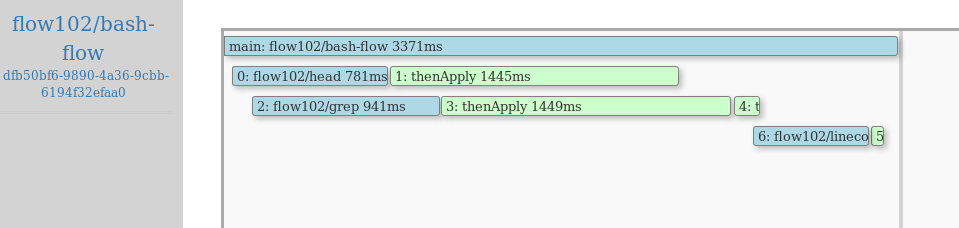

# Flow 102

#### `Under Construction: Check back soon`
```
Due to ongoing changes to Fn core, parts of this tutorial 
may not function as described. Check back for updates.
```

This tutorial is based on [Matthew Gilliard's "Flow 102" blog post](https://mjg123.github.io/2017/10/11/FnProject-Flow-102.html).

If you haven't read [Flow 101](../Flow101/README.md) yet, we recommend you to start there to understand what Flow is, what it's used for and how it works.

In this tutorial we will go through how to build a more complex Flow with parallelism and asynchronous chaining. We will assume you have set up the services as described in the Flow 101.

## The demo Flow

An app which:

  * reads some text
  * greps for a given keyword
  * counts the matching lines
  * prints the count
  * prints the file header

In your shell, it might look something like:

```shell
⇒ cat my_file | grep -i love | wc -l | xargs -n1 echo result:
⇒ head -n10 my_file
```

## Before you begin
> As you make your way through this tutorial, look out for this icon . Whenever you see it, it's time for you to perform an action.


## Installing helper functions

One of the cool things about Fn is that because it's based on Docker, functions can be written in *any* language - even Bash!

Clone this repo of simple Bash functions and deploy them all:


>```shell
>git clone https://github.com/mjg123/fnproject-text-functions.git
>```

Change directory:


>```shell
>cd fnproject-text-functions
>```

Deploy them all:


>```shell
>fn deploy --local --all
>```

You can test all of these individually, for example:


>```shell
>curl -H "Word: bar" -d $' foo \n bar \n baz' http://localhost:8080/r/flow102/grep
>```

The output looks something like the following:

```
bar
```


## Creating our Flow function

Run the following command to create a new directory called `word-flow`:


>```shell
>fn init --runtime=java word-flow
>cd word-flow
>```

Flow has a comprehensive test framework, but lets concentrate on playing with the code for the time being:


>```shell
> rm -rf src/test   ## yolo, again
>```


And, make `HelloFunction.java` look like this:


```java
package com.example.fn;

import com.fnproject.fn.api.flow.Flow;
import com.fnproject.fn.api.flow.FlowFuture;
import com.fnproject.fn.api.flow.Flows;
import com.fnproject.fn.api.flow.HttpResponse;

import static com.fnproject.fn.api.Headers.emptyHeaders;
import static com.fnproject.fn.api.flow.HttpMethod.POST;

public class HelloFunction {

    public String handleRequest(String input) {
        Flow flow = Flows.currentFlow();

        // Get the first ten lines of the file
        FlowFuture<byte[]> headText = flow.invokeFunction( "./head", POST,
                    emptyHeaders().withHeader("LINES", "10"), input.getBytes() )
                .thenApply(HttpResponse::getBodyAsBytes);

        // Grep for "love"
        FlowFuture<byte[]> wordCountResult =
                flow.invokeFunction( "./grep", POST,
                                     emptyHeaders().withHeader("WORD", "love"),
                                     input.getBytes())
                .thenApply(HttpResponse::getBodyAsBytes)

        // and count the hits
                .thenCompose( grepResponse ->
                        flow.invokeFunction("./linecount", POST,
                                            emptyHeaders(),
                                            grepResponse ))
                .thenApply(HttpResponse::getBodyAsBytes);


        return "Number of times I found 'love': " + new String(wordCountResult.get()) + "\n" +
               "The first ten lines are: \n" + new String(headText.get());
    }
}
```

It's worth reading this code carefully, remembering that anything returning a `FlowFuture` object is an asynchronous call, which can be chained with `thenApply`, `thenCompose` and the other [Flow API methods](https://github.com/fnproject/fdk-java/blob/master/api/src/main/java/com/fnproject/fn/api/flow/Flow.java).

We'll want some test data:


>```shell
>curl http://www.gutenberg.org/files/1524/1524-0.txt > hamlet.txt
>```

Set the FLOWSERVER_IP environment variable:


<!-- The HTML is required to escape Jekyll Liquid template expressions.
Otherwise, double brackets and their contents are stripped from output.
 -->
<blockquote>
<pre><code>
FLOWSERVER_IP=$(docker inspect --type container -f '{{.NetworkSettings.IPAddress}}' flowserver)
</code></pre>
</blockquote>

Configure the app with the location of the completer:


>```shell
>fn config app flow102 COMPLETER_BASE_URL "http://$FLOWSERVER_IP:8081"
>```

Deploy the function:


>```shell
>fn deploy --app flow102 --local
>```

And... send in the Shakespeare:


>```shell
>curl --data-binary @hamlet.txt http://localhost:8080/r/flow102/word-flow
>```

The output looks something like the following:

```
Number of times I found 'love': 76

The first ten lines are:
...etc etc...
```

## Visualising the Flow

Check the UI on [http://localhost:3002](http://localhost:3002) and you should see something like this:



As you could see from the code above, the `head` and `grep` are executed in parallel, the `linecount` has to wait for the `grep`, and the `main` has to wait till everything else is finished.

## Learn more

Go to the next tutorial [FlowSaga](/FlowSaga/README.md). FlowSaga is a more complex Flow tutorial where you will develop a ployglot travel booking application using Fn Flow.
