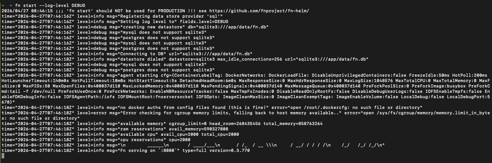
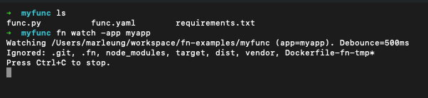
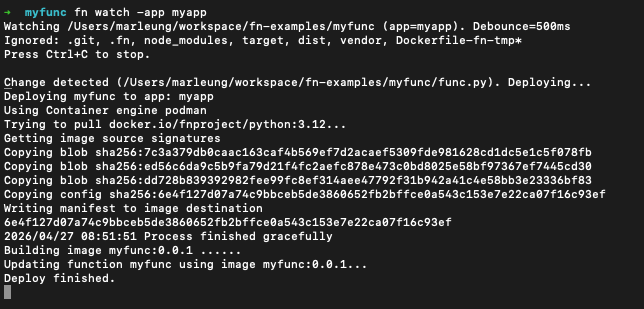
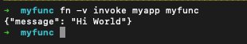

# Enable Hot Reload when developing OCI Functions locally

When developing Functions locally, Fn allows you to enable hot reload. When hot reload is enabled, your changes will be
automatically detected and will trigger function local deployment to the application that you have specified.

## Before you Begin
* Set aside about 15 minutes to complete this tutorial.
* Make sure Fn server is up and running by completing the [Install and Start Fn Tutorial](../install/README.md).
    * Make sure you have set your Fn context registry value for local development. (for example, "fndemouser". [See here](https://github.com/fnproject/tutorials/blob/master/install/README.md#configure-your-context).)

As you make your way through this tutorial, look out for this icon.  Whenever you see it, it's time for you to perform an
action.


## Start Fn
In the terminal, type the following to start Fn. Optionally, you could start with "--log-level DEBUG" arguments so you
could see more messages.


>```sh
> fn start --log-level DEBUG
>```



## Hot Reload for Python Function

Suppose you have an application called "myapp" that setup locally, and you have initialized a function called "myfunc". Under the
functions directory, where the func.yaml located, you could run the following to enable Hot Reload.


>```sh
> fn watch -app myapp
>```



Now you could change the code for Functions. Here we modify the output string from "Hello" to "Hi".

You could see that the local deployment will be triggered automatically.




If you invoke the function, you could see the new change:




## Supported Language
All languages supported by OCI Functions have hot reload feature supported.

## Ignoring paths
`fn watch` ignores these directories by default:

- `.git`, `.fn`, `node_modules`, `target`, `dist`, `vendor`, `Dockerfile-fn-tmp*`

You can add more ignore rules by creating a `.fnignore` file in the watched directory (one pattern per line; `#` comments supported), and/or by passing `--ignore` flags.


