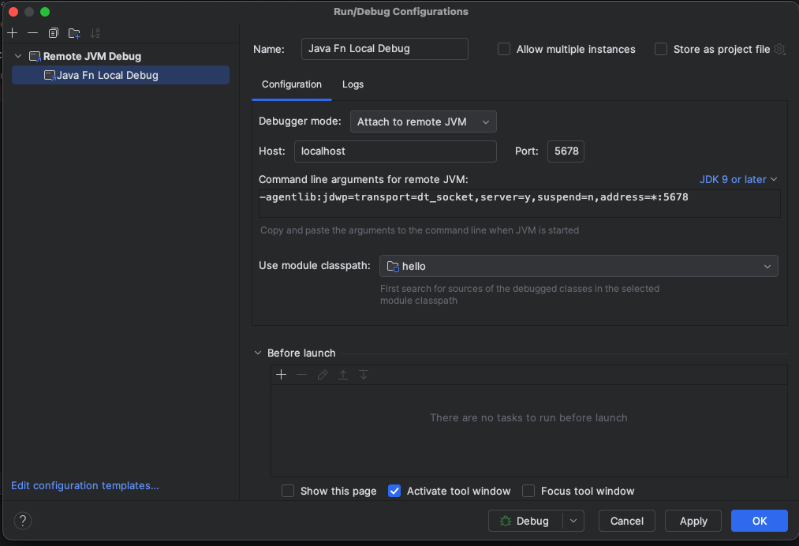
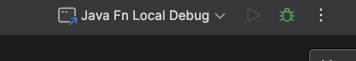
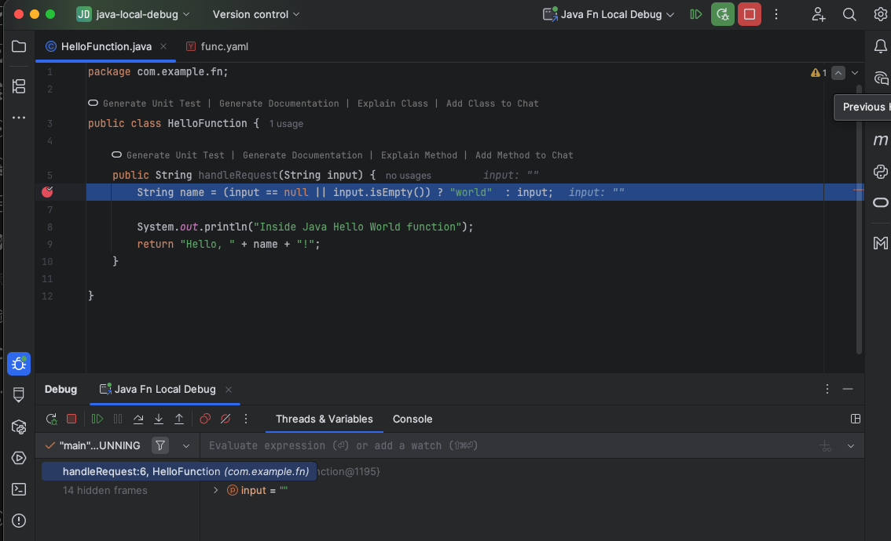
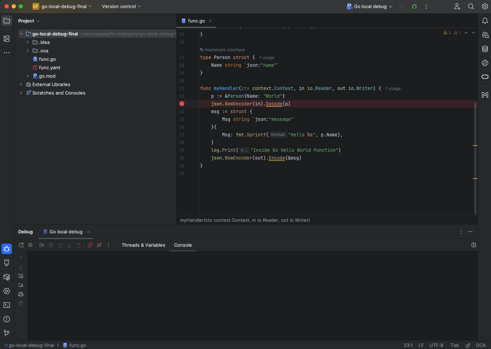
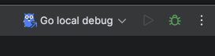
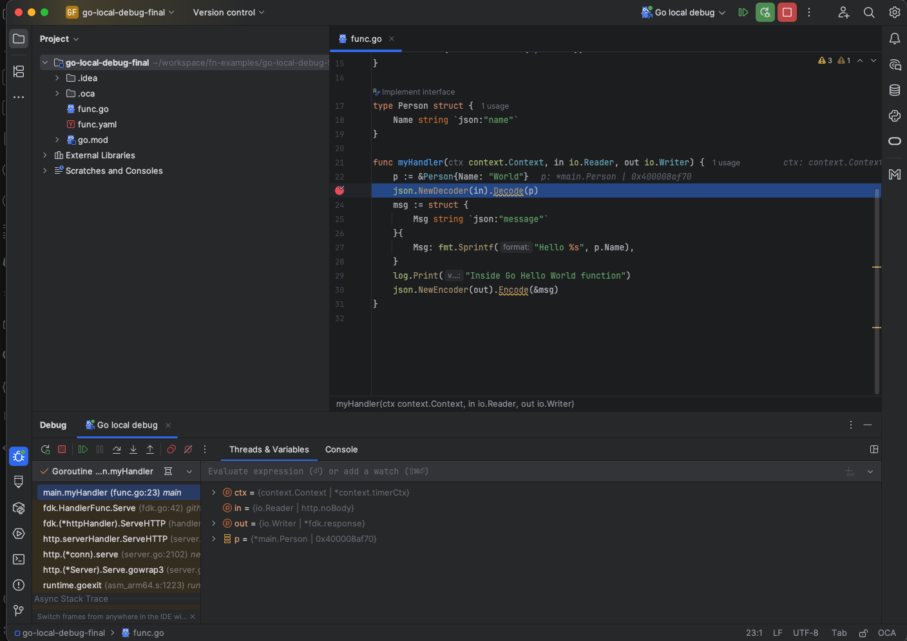
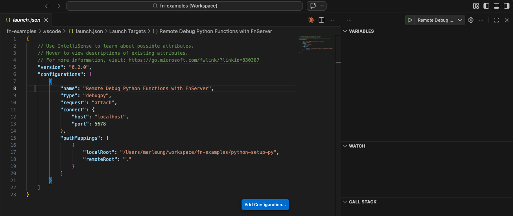
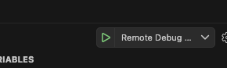
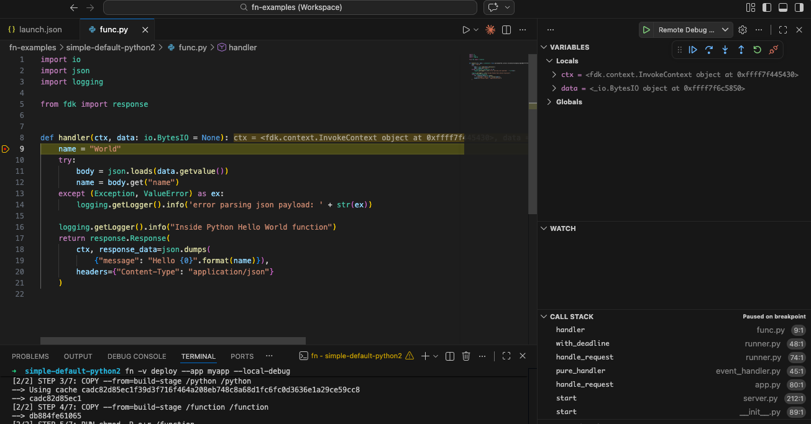

# Debug function locally

Fn allows you to deploy your function locally and attach your favorite debugger to debug your function.
In this tutorial, we will walk throught the setup. Currently, we support the local debug feature for
Go, Python and Java function. Local debugging is also possible for users that are using custom docker file.

## Before you Begin
* Set aside about 15 minutes to complete this tutorial.
* Make sure Fn server is up and running by completing the [Install and Start Fn Tutorial](../install/README.md).
    * Make sure you have set your Fn context registry value for local development. (for example, "fndemouser". [See here](https://github.com/fnproject/tutorials/blob/master/install/README.md#configure-your-context).)

As you make your way through this tutorial, look out for this icon.  Whenever you see it, it's time for you to perform an
action.

## Start Fn in Debug mode
In the terminal, type the following to start Fn in debug mode.


>```sh
> fn start --local-debug --local-debug-port <port number>
>```

"local-debug-port" is an optional parameter. If you do not specify, it will use 5678 in your host machine.
It is the port for your remote debugger to attach to.

## Local Debug for Java Function

Suppose you have already created your function "myfunc", you could deploy your function in debug mode by running the following:


>```sh
> fn deploy --app myapp --local-debug --local-debug-port <e.g. 5678. Optional. 5678 by default>
>```

Once you have done that, the docker image will be built with debug capability. Debug port will be exposed and mapped to local host.
If you trigger your function now, you will see the function paused and waiting for remote debugger to attach.


>```sh
> fn invoke myapp myfunc
>```

Here we use Intellij as an example. Please open your function directory in Intellij and setup Debug configuration as shown below.


Please use the port 5678 or the custom port if you have specified in previous step.

Add a breakpoint to your code. Then you can click the debug button as shown below.


And you will see your breakpoint got triggered.


## Local Debug for Go Function

Debugging Go function is similar to Java. You could open your Go function in Intellij/Goland as a project and add a debug configuration.
Here is the debug configuration you could setup in Intellij/Goland.


Then you could deploy the function and then invoke it. The steps are same as those in Java section.

Then you will see the function paused and waiting for a debugger to attach.

Add a breakpoint to your code. Now you could start the debug session by pressing the debug button in Intellij/Goland.


And you will see your breakpoint got triggered.



## Local Debug for Python Function

Debugging Python is similar to Go and Java. In this example, we will use VSCode instead.


Then you could deploy the function and then invoke it. The steps are same as those in Java section.

Then you will see the function paused and waiting for a debugger to attach.

Open your python function in VSCode. You could add a debug configuration as shown below:


Make sure the `localRoot` path is pointing to your python function directory.

Add a breakpoint to your code. Now you could start the debug session by pressing the debug button in VSCode.


And you will see your breakpoint got triggered.



## Local Debug for custom docker file

For user that are using their custom docker file, they have to do the following to allow remote debugger to attach to
the function container when it is started up by Fn.

1. Install language specific debugger in your function image. For go, it could be Delve. For Python, it could be debugpy.
2. Start up the debugger in port 5678. It has to be 5678. Fn will map this port to `local-debug-port` in local host. 
The `local-debug-port` is specified when you run the `fn start --local-debug`. By default, it is also 5678.
3. Add any language specific setting in your custom docker file. For example, for Go, you are required to pass specific
build flags to enabling debugging.

Here is an example for Go function:
```
FROM fnproject/go:1.24-dev as build-stage
WORKDIR /function
WORKDIR /go/src/func/
ENV GO111MODULE=on
COPY . .
RUN go mod tidy
RUN go build -gcflags="all=-N -l" -o func -v
RUN go install github.com/go-delve/delve/cmd/dlv@latest

FROM fnproject/go:1.24
WORKDIR /function
COPY --from=build-stage /go/src/func/func /function/
COPY --from=build-stage /go/bin/dlv /function
CMD ["/function/dlv", "--listen=:5678", "--headless=true", "--api-version=2", "--accept-multiclient", "exec", "./func"]
```

