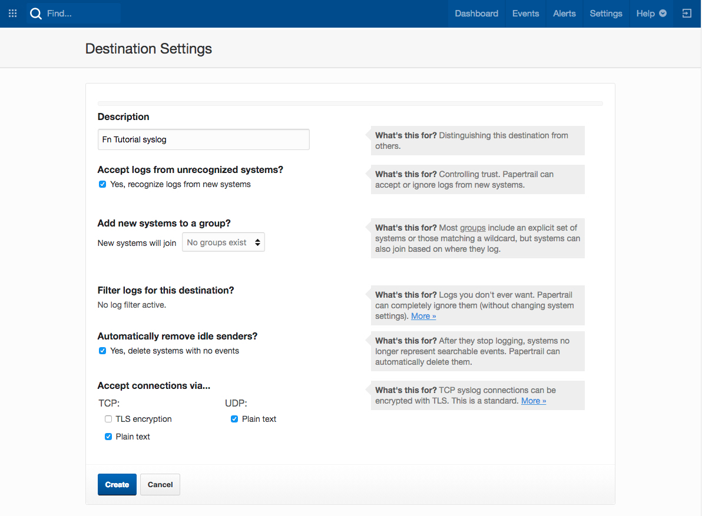
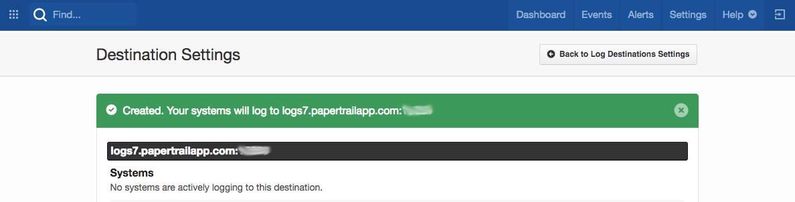
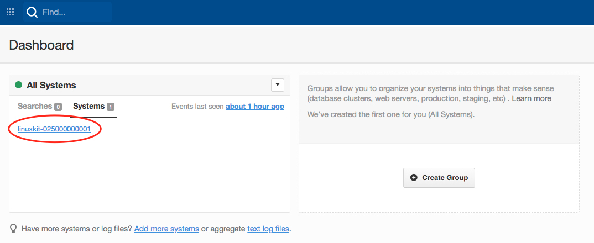
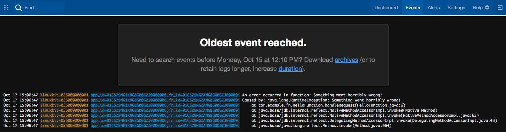

# Troubleshooting and Logging with Fn

Even if you've got excellent unit tests (e.g., using the
[Fn Java JUnit support](https://github.com/fnproject/fdk-java/blob/master/docs/TestingFunctions.md))
things can still go wrong.  Your function may throw an exception,
or you may be getting back unexpected results? So what can you do to troubleshoot
your functions?  In this tutorial we'll look at a number of techniques and Fn 
features you can use to get to the root cause of your problem.

As you make your way through this tutorial, look out for this icon.
 Whenever you see it, it's time for you to
perform an action.

## Getting Started

First, let's create a simple Java function called `trouble`.  In a new folder
type:


>```sh
> fn init --runtime java trouble
>```

This will create a boilerplate Java hello world function in the `trouble`
folder.  Let's cd into that folder.


>```sh
> cd trouble
>```

And let's delete the unit tests so we can concentrate on the troubleshooting
techniques rather than keeping the tests up to date.


>```sh
> rm -rf src/test
>```

__If__ you have the `tree` utility installed you can verify that your structure
looks like this:

```sh
.
├── func.yaml
├── pom.xml
└── src
    └── main
        └── java
            └── com
                └── example
                    └── fn
                        └── HelloFunction.java
```

Ok, we're ready to begin!

## Verbose Mode

When you run commands like `fn build` or `fn deploy` you typically see "progress
dots" (i.e., `...`) that let's you know some action is taking place.  Let's
build our function and observe the output.


>```sh
> fn build
>```

You should see something like:

```sh
Building image trouble:0.0.1 ........
Function trouble:0.0.1 built successfully.
```

Perfect!  But if your code can't be built successfully, either not compiling or
failing unit tests, then you get a helpful error message suggesting you rerun
your command with the `--verbose`/`-v` flag.

To see this let's
break the function so it won't compile. Comment out the return statement in the
`HelloFunction` class' `handleRequest` function by putting `//` in front of the
`return` statement so it looks like:


```java
package com.example.fn;

public class HelloFunction {

    public String handleRequest(String input) {
        String name = (input == null || input.isEmpty()) ? "world"  : input;

        //return "Hello, " + name + "!";
    }

}
```

Let's build again and checkout the error message.


>```sh
> fn build
>```

Results in:

```sh
Building image trouble:0.0.1 .....
Error during build. Run with `--verbose` flag to see what went wrong. eg: `fn --verbose CMD`

Fn: error running docker build: exit status 1

See 'fn <command> --help' for more information. Client version: 0.5.86
```

Now let's try the build with the `--verbose` flag, which you need to put 
*immediately* after `fn`:


>```sh
> fn --verbose build
>```

Now we see details of the build and the failure (output abbreviated):

```sh
Building image trouble:0.0.1
Sending build context to Docker daemon  10.24kB
Step 1/11 : FROM fnproject/fn-java-fdk-build:jdk11-1.0.102 as build-stage
 ---> cc41c56dd693
...
[INFO] --- maven-compiler-plugin:3.3:compile (default-compile) @ hello ---
[INFO] Changes detected - recompiling the module!
[INFO] Compiling 1 source file to /function/target/classes
[INFO] -------------------------------------------------------------
[ERROR] COMPILATION ERROR :
[INFO] -------------------------------------------------------------
[ERROR] /function/src/main/java/com/example/fn/HelloFunction.java:[9,5] missing return statement
[INFO] 1 error
...
[ERROR] Failed to execute goal org.apache.maven.plugins:maven-compiler-plugin:3.3:compile (default-compile) on project hello: Compilation failure
[ERROR] /function/src/main/java/com/example/fn/HelloFunction.java:[9,5] missing return statement
...
The command 'mvn package' returned a non-zero code: 1
...
ERROR: error running docker build: exit status 1
```

With verbose output we see the entirety of the Maven build which includes an
error message telling us we're missing a return statement--as we expected.

When an unexpected error happens, verbose output is the first thing you need to
enable to diagnose the issue.

## Logs

When calling a deployed function, Fn captures all standard error output and sends
it to a syslog server, if configured. So if you have a
function throwing an exception and the stack trace is being written to standard
error it's straightforward to get that stack trace via syslog.

Create the `tutorial` application.

>```sh
> fn create app tutorial
>```

Let's update our HelloFunction so that it writes an error message and then throws an exception in the
`handleRequst` method.  Replace the definition of HelloFunction with the
following:


```java
package com.example.fn;

public class HelloFunction {

    public String handleRequest(String input) {
        System.err.println("Something wrong is going to happen");
        throw new RuntimeException("Something went horribly wrong!");
    }

}
```

With this change let's deploy the function and invoke it. If you haven't got an
Fn server running locally you can follow the
[Install and Start Fn](../install/README.md) tutorial to get setup.


>```sh
> fn deploy --app tutorial --local
>```

```sh
Deploying trouble to app: tutorial
Bumped to version 0.0.2
Building image trouble:0.0.2
Updating function trouble using image trouble:0.0.2...
Successfully created app:  tutorial
Successfully created function: trouble with trouble:0.0.2
```

You can verified the function is deployed successfully by listing
the functions of the 'tutorial' app:


>```sh
> fn ls functions tutorial
>```

Or the slightly more economical:


>```sh
> fn ls f tutorial
>```

```sh
NAME     IMAGE          ID
trouble  trouble:0.0.1  01CT1QZFJTNG8G00GZJ0000002
```

With the function defined let's invoke it and see what happens when if fails:


>```sh
> fn invoke tutorial trouble
>```

```sh
Error invoking function. status: 502 message: function failed
```

This is not much information to go on to debug the problem.  What we need to
do is look at the logs!

### Log Capture

We need to capture the logs for the function so that we can see what happens
when it fails.  To capture logs you need to configure the `tutoral` application
with the URL of a syslog server.  You can do this either when you create an
app or after it's been created.  

When creating a new app you can specify the URL using the `--syslog-url` option
as in:

```sh
fn create app tutorial --syslog-url tcp://mysyslogserver.com
```

Since we've already created the 'tutorial' app, we'll have to update it using
`fn update app`.  But before we do that we'll need
a syslog server ready to receive log data.  For the purposes of this
tutorial we'll setup and use a free [Papertrail](https://papertrailapp.com/)
account. Papertrail is a cloud log management service. To get setup:

1. Sign up for a [free Papertrail account](https://papertrailapp.com/signup?plan=free)
2. On the Papertrail website, go to 'Settings' (top right hand corner), click on
'Log Destinations', and click 'Create a Log Destination'.

3. In the create dialog, under TCP unselect 'TLS' and under both TCP and UDP
select 'Plain Text'

4. Click 'Create'
5. You'll see the address of your log destination displayed at the top of the
page looking something like `logs7.papertrailapp.com:<PORT>`. Copy this value
to your clipboard for use in a minute.


Ok, now that we have a log destination we can update the syslog url of our
application:


>```sh
> fn update app tutorial --syslog-url tcp://[your Papertrail destination]
>```

```sh
app tutorial updated
```

You can confirm that the syslog URL is set correctly by inspecting your
application:


>```sh
> fn inspect app tutorial
>```

Which will return JSON looking something like:

```sh
{
	"created_at": "2019-10-13T14:54:45.459Z",
	"id": "01CT1QZFJ7NG8G00GZJ0000001",
	"name": "tutorial",
	"syslog_url": "tcp://logs7.papertrailapp.com:NNNN",
	"updated_at": "2019-10-13T15:55:50.628Z"
}
```

`syslog_url` looks to be pointing to Papertrail so let's rerun our failing
function:


>```sh
> fn invoke tutorial trouble
>```

Of course it still fails.  Let's go over to the Papertrail Dashboard and
click on our "System" to open a page with the log showing our exception.





You can leave the Papertrail log view open while debugging to monitor the log
output in near realtime.  Give it a try!

## DEBUG=1

If you're interacting with functions via the `fn` CLI, you can enable debug
mode to see the full details of the HTTP requests going to the Fn server and
the responses. The `fn` CLI simply wraps the Fn API to make it easier to
manage your applications and functions. You can always use `curl` but the CLI 
is much more convenient!

You enable debug mode by adding `DEBUG=1` before `fn` on each command.  For
example try the following:


>```sh
> DEBUG=1 fn ls apps
>```

Which, with debugging turn on, returns the following:

```sh
GET /v2/apps HTTP/1.1
Host: localhost:8080
User-Agent: Go-http-client/1.1
Accept: application/json
Accept-Encoding: gzip


HTTP/1.1 200 OK
Content-Length: 977
Content-Type: application/json; charset=utf-8
Date: Sun, 13 Oct 2019 16:45:56 GMT


{"items":[{"id":"01DQ2STN6KNG8G00GZJ000001Q","name":"tutorial","syslog_url":"tcp://logs3.papertrailapp.com:NNNN","created_at":"2019-10-13T14:54:45.459Z","updated_at":"2019-10-13T15:55:50.628Z"}]}
NAME		ID
tutorial	01DQ2STN6KNG8G00GZJ000001Q
```

All debug output is written to stderr while the normal response is written
to stdout so it's easy to capture or pipe either for processing.

## Wrapping Up

That's brief intro to troubleshooting techniques for Fn today.  We'll update
this tutorial as new features become available.

**Go:** [Back to Contents](../README.md)
