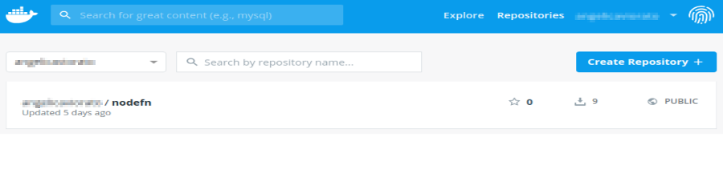

# Fn Development with Multiple Contexts
The Fn context stores configuration about your functions, your Fn server and the location of your Docker images. You can configure multiple contexts for your function development. For example, let's do the following:

* For local development, configure the Fn registry with an arbitrary value such as "fndemouser". This will save any docker images locally.
* For cloud development, configure a new Fn registry and store your images on Docker Hub.

## Before you Begin

* Set aside about 20 minutes to complete this tutorial.
* Make sure the Fn server is up and running on your computer, see [Install Fn](../install/README.md) for more details.
* Have your Docker Hub credentials handy.
* Have a second computer or virtual machine you can run Fn server on.

> As you make your way through this tutorial, look out for this icon.
 Whenever you see it, it's time for you to
perform an action.

## Configure your Default Context
First, set up your default context [as described in the install tutorial](https://github.com/fnproject/tutorials/blob/master/install/README.md#configure-your-context).

To make sure your default Fn context is set correctly, list the contexts.


>```
> fn ls contexts
>```

```txt
CURRENT NAME    PROVIDER  API URL                REGISTRY
*       default default   http://localhost:8080  fndemouser
```

This shows that the default context is currently selected and the registry value is set to "fndemouser". Since `fndemouser` is just a string, your local Docker repository is used to store images.


## Create your Own Context
With the default context set, create your own context. To start setup the context for local development.

For example:


>```
> fn create context my-local-ctx --api-url http://localhost:8080 --registry fnlocal
>```

```yaml
Successfully created context: my-local-ctx
```

Here is a description of each command option.

* `--provider` - The name of your repository provider. Leave with the value of "default". This is just a metadata field used to distinguish different Fn providers.
* `--api-url` - The api address and port of the Fn Server where your application is deployed. It can be a local server, as in this example, or you can use a remote server.
* `--registry` - Name of your registry. For local development purposes you can define any name that makes sense to you. Any name that cannot be resolved on the network defaults to using your local Docker repository. To store your Docker images on Docker Hub you must provide your Docker ID.

List your contexts again to see your changes.


>```
> fn ls contexts
>```

```txt
CURRENT NAME         PROVIDER  API URL                REGISTRY
*       default      default   http://localhost:8080  fndemouser
        my-local-ctx default   http://localhost:8080  fnlocal
```

### Fn Contexts Storage
For each Fn context, you have a configuration file in a yaml format. You can find the context configuration files in the `~/.fn/contexts` directory.

Let's take a look to the `my-local-ctx.yaml` context file:


>```
> cat ~/.fn/contexts/my-local-ctx.yaml
>```

```yaml
api-url: http://localhost:8080
provider: default
registry: fnlocal
```

The `default.yaml` context file looks like this:


>```
> cat ~/.fn/contexts/default.yaml
>```

```yaml
api-url: http://localhost:8080
provider: default
registry: fndemouser
```

Alternatively to the `fn create context` command,  you can create a new configuration file using the yaml format shown and by placing the file in the `~/.fn/contexts` directory.

### Switch to your New Context
To use a context, you must select it. Set `my-local-ctx` as the current context.


>```
> fn use context my-local-ctx
>```

```yaml
Now using context: my-local-ctx
```

List your contexts again to see your changes.


>```
> fn ls contexts
>```

```txt
CURRENT NAME         PROVIDER   API URL                REGISTRY
        default      default    http://localhost:8080  fndemouser
*       my-local-ctx default    http://localhost:8080  fnlocal
```

The context you created is now ready for local deployment.


## Deploy a Function Locally with your Context
Let's deploy a simple a Node.js "Hello World!" function using our new context.


### Create Your Function
In a terminal type the following:


>```
> fn init --runtime node nodefn
>```

```txt
Creating function at: /nodefn
Function boilerplate generated.
func.yaml created.
```

A new directory is created for your function.

Go to your function directory.


>```
> cd nodefn
>```

Notice this directory has several files.
* `func.js` - contains the generated Node function.
* `func.yaml` - is the function configuration file and lists its properties such as schema, name, version, runtime, and entrypoint.
* `package.json` - specifies the Node.js dependecies required for this function.


### Create an Application
Let's create an application for our function. To create the application, type the following:


>```
> fn create app nodeapp
>```

```txt
Successfully created app: nodeapp
```


### Deploy Your Function to a Local Server
Deploy your function to your local Fn server.


>```
> fn deploy --app nodeapp --local
>```

```yaml
Deploying nodefn to app: nodeapp
Bumped to version 0.0.2
Building image fnlocal/nodefn:0.0.2 ................................
Updating function nodefn using image fnlocal/nodefn:0.0.2...
Successfully created function: nodefn with fnlocal/nodefn:0.0.2
```

**Note:** Fn is based on Docker and when you first run the `fn start` command the Fn server docker image (fnproject/fnserver) is downloaded and started. When you run the deploy command, a new image is created to store your function and it resides on your computer. In this case, the function was packaged in the `fnlocal/nodefn:0.0.2` image.

You may have a number of Docker images so use the following command to see only those created by `fnlocal`:


>```
> docker images | grep fnlocal
>```

```txt
REPOSITORY      TAG     IMAGE ID        CREATED         SIZE
fnlocal/nodefn  0.0.2   b33abfd56e02    6 minutes ago   75.5MB
```

The Docker image resides only on your local machine. If you want to deploy your function to other servers, then you need a Docker registry like Docker Hub to store your images.

## Push your Images to Docker Hub
A Docker registry is a system that stores Docker images. You can use Docker Hub to organize your Docker images into repositories. For example, a repository can have multiple versions of your image. By pushing your image to a Docker registry, you make your image public and accessible to other users and systems.

### Set your Registry
To use Docker Hub as your registry, log in Docker using your user name and password. You can use the GUI or the command line:


>```
> docker login
>```
```txt
Login with your Docker ID to push and pull images from Docker Hub. If you don't have a Docker ID, head over to https://hub.docker.com to create one.
Username: <your-docker-username>
Password: <your-docker-password>
WARNING! Your password will be stored unencrypted in /home/admin/.docker/config.json.
Configure a credential helper to remove this warning. See
https://docs.docker.com/engine/reference/commandline/login/#credentials-store
```

Update the registry value to your Docker account for your context:


>```
> fn update context registry <your-docker-id>
>```

```txt
Current context updated registry with <your-docker-id>
```

List your contexts again to see your changes.


>```
> fn ls contexts
>```

```txt
CURRENT NAME         PROVIDER   API URL                 REGISTRY
        default      default    http://localhost:8080   fndemouser
*       my-local-ctx default    http://localhost:8080   <docker-id>
```


### Re-deploy your Function
Fn associates your function with the specified application. This time, your function is packaged into an image and uploaded to Docker Hub. In the deploy command, add the `--verbose` option to get more detailed information at deployment time.


>```
> fn --verbose deploy --app nodeapp
>```
```txt
Deploying nodefn to app: nodeapp
Bumped to version 0.0.3
Building image <your-docker-username>/nodefn:0.0.3
FN_REGISTRY:  <your-docker-username>
Current Context:  default
Sending build context to Docker daemon   5.12kB
Step 1/9 : FROM fnproject/node:dev as build-stage
 ---> b557a05fec78
Step 2/9 : WORKDIR /function
 ---> Using cache
 ---> c8eb883935a7
Step 3/9 : ADD package.json /function/
 ---> Using cache
 ---> 757b892bca3f
Step 4/9 : RUN npm install
 ---> Using cache
 ---> f892f58a35d1
Step 5/9 : FROM fnproject/node
 ---> c8da69259495
Step 6/9 : WORKDIR /function
 ---> Using cache
 ---> 242b3edcc9ce
Step 7/9 : ADD . /function/
 ---> aea48b1226fe
Step 8/9 : COPY --from=build-stage /function/node_modules/ /function/node_modules/
 ---> af7480fb140d
Step 9/9 : ENTRYPOINT ["node", "func.js"]
 ---> Running in 3ac9dd811f3a
Removing intermediate container 3ac9dd811f3a
 ---> 6b4fc7b57c9e
Successfully built 6b4fc7b57c9e
Successfully tagged <your-docker-username>/nodefn:0.0.3
Parts:  [<your-docker-username> nodefn:0.0.3]
Pushing <your-docker-username>/nodefn:0.0.3 to docker registry...The push refers to repository [docker.io/<your-docker-username>/nodefn]
3a49149033c6: Pushed
98a742988717: Pushed
631d3e0bcdc8: Layer already exists
a0d7b4199dce: Layer already exists
8aed3db29123: Layer already exists
9c85c117f8f6: Layer already exists
a464c54f93a9: Layer already exists
0.0.3: digest: sha256:aa5f44a916ba91237e584ec7accf455692e8fb7e52610b6bbd12573b7e836d0b size: 1781
Updating function nodefn using image <your-docker-username>/nodefn:0.0.3...
```

**Note:** Every time you redeploy, a new image and version are created. Since you defined your Docker Hub account in the registry property of the default context, this time the image is uploaded to Docker Hub.

List the images on your local machine.


>```
> docker images | grep nodefn
>```

```txt
REPOSITORY          TAG     IMAGE ID        CREATED         SIZE
<docker_id>/nodefn  0.0.3   6b4fc7b57c9e    6 minutes ago   75.5MB
fnlocal/nodefn      0.0.2   b33abfd56e02    9 minutes ago   75.5MB
```


Go to your [Docker Hub account](https://hub.docker.com/) and confirm your image was uploaded.


You see a new copy of the node function image stored in your Docker Hub repository.


## Deploy your Function to a Second Machine
With your Function image stored on the Net, you can easily deploy your function to another server. The other server will just pull the image from Docker Hub.

### Setup the New Machine
Setup Fn server on a new machine and make sure it is up and running, see [Install Fn](../install/README.md) for more details. **Note:** Make sure your new server is up and running.

### Point your Context to the New Machinie
List your contexts again to make sure your are still using the context you created.


>```
> fn ls contexts
>```

```txt
CURRENT NAME         PROVIDER   API URL                 REGISTRY
        default      default    http://localhost:8080   fndemouser
*       my-local-ctx default    http://localhost:8080   <docker-id>
```

Update the API-URL to point your context to the new server.


>```
> fn update context api-url http://newhost:8080
>```

```txt
Current context updated api-url with http://newhost:8080
```
Now your context points to a different server. All Fn commands will run against that server since that is what you have configured in your context.

List your contexts again to see your changes.


>```
> fn ls contexts
>```

```txt
CURRENT NAME         PROVIDER   API URL                 REGISTRY
        default      default    http://localhost:8080   fndemouser
*       my-local-ctx default    http://newhost:8080     <docker-id>
```

Now when you get a list of the apps, you see the apps on the new server. For example:


>```
> fn ls apps
>```

```txt
NAME        ID
helloapp    01DPA5XMV4NG8G00GZJ000000
java-app    01DJ61KDV7NG8G00GZJ0000001
```

Create your application on the new machine. We use the name "nodeapp2" to distinguish it from the app running on our local server.


>```
> fn create app nodeapp2
>```

```txt
Successfully created app: nodeapp2
```

### Deploy your Function to the New Host
Deploy your function to the new Fn server. **Notice:** No `--local` switch is used.


>```
> fn deploy --app nodeapp2
>```

```yaml
Deploying nodefn to app: nodeapp2
Bumped to version 0.0.4
Building image <docker-id>/nodefn:0.0.4 .
Parts:  [<docker-id> nodefn:0.0.4]
Pushing <docker-id>/nodefn:0.0.4 to docker registry...The push refers to repository [docker.io/<docker-id>/nodefn]
317a45d1ddd7: Pushed
96131db00565: Pushed
615802602347: Layer already exists
a0d7b4199dce: Layer already exists
8aed3db29123: Layer already exists
9c85c117f8f6: Layer already exists
a464c54f93a9: Layer already exists
0.0.4: digest: sha256:7fdbf736f7bb4f9179d3c100fb391678b452ec3051d4a9a59bc7e1d01b51dc6c size: 1781
Updating function nodefn using image <docker-id>/nodefn:0.0.4...
```

List the Docker images on your local machine.


>```
> docker images | grep nodefn
>```

```txt
REPOSITORY          TAG     IMAGE ID        CREATED         SIZE
<docker-id>/nodefn  0.0.4   52f9bd11d01a    3 minutes ago   75.5MB
<docker-id>/nodefn  0.0.3   64ae6d46d0bd    37 minutes ago  75.5MB
fnlocal/nodefn      0.0.2   2774d18bca11    45 minutes ago  75.5MB
```
A new image is created on Docker Hub for this version of the function.

### Invoke your Function
Finally, invoke your function


>```
> fn invoke nodeapp2 nodefn
>```

```js
{"message":"Hello World"}
```

## Summary
You have invoked your function on another Fn server just by updating your context to point to Docker Hub and another Fn Server. Now you have two contexts you can use to development functions. The "default" context can be used for local development while "my-local-ctx" points to Docker Hub and another server. With Fn, it is easy to setup multiple contexts for function development and testing.
